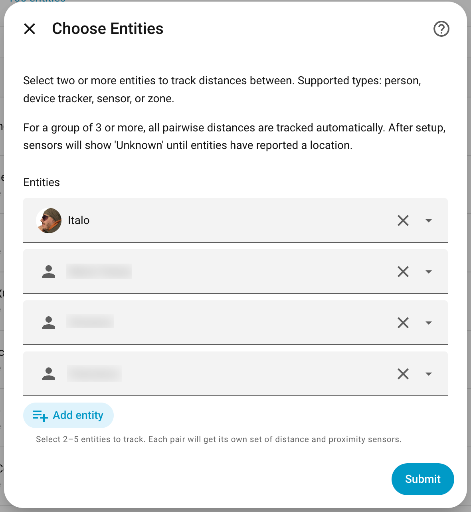
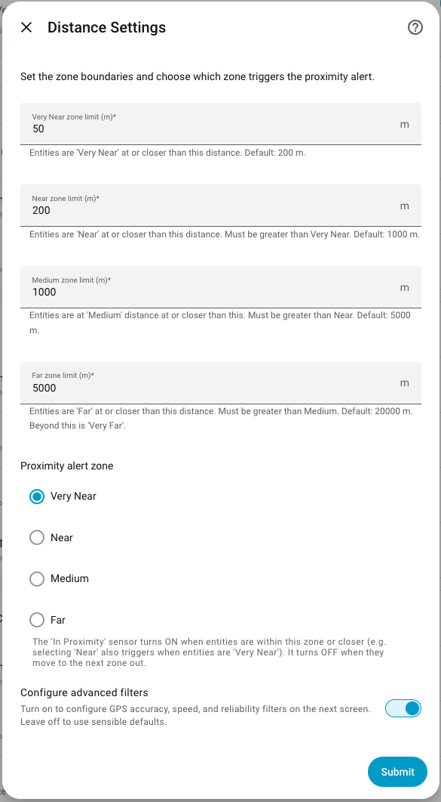
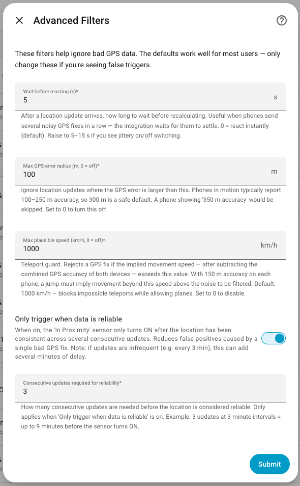
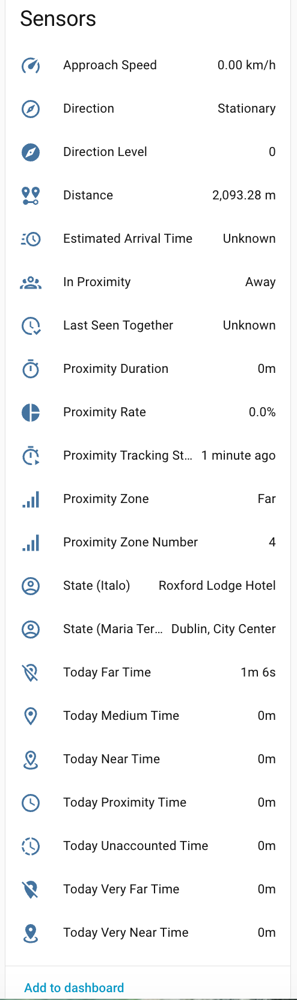
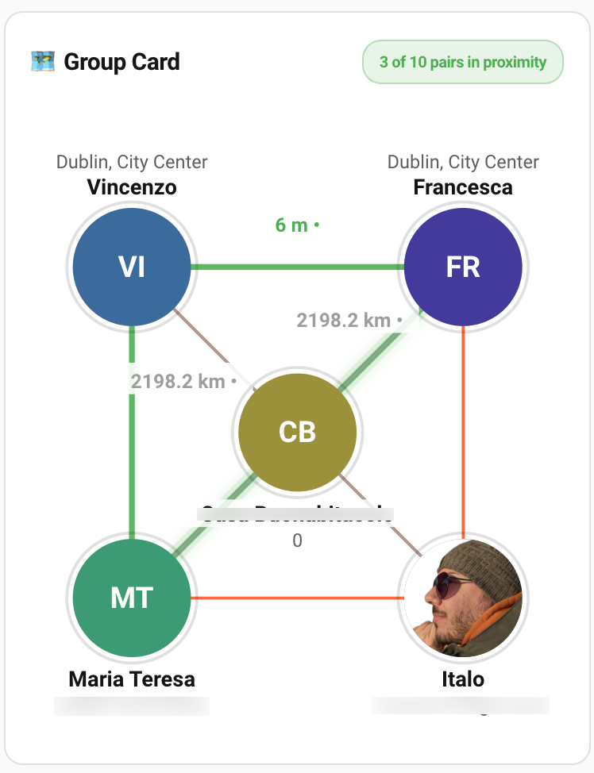
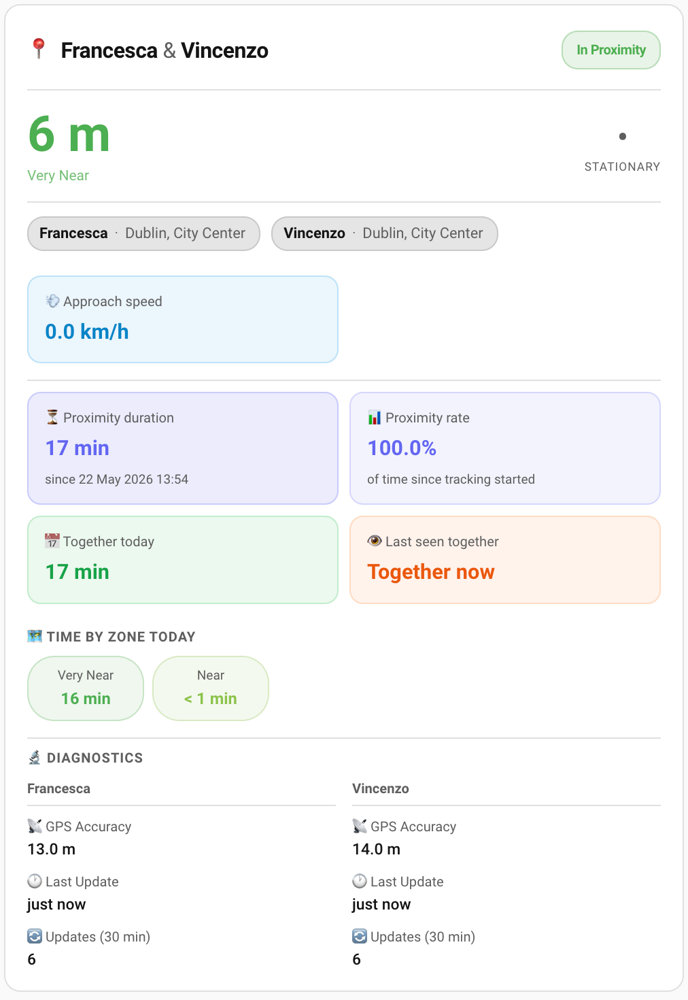
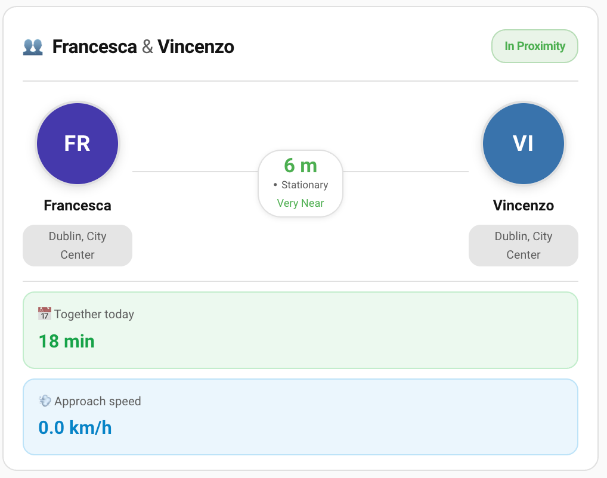

# Entity Distance for Home Assistant

<a href="https://github.com/italo-lombardi/Home-Assistant-EntityDistance/releases"></a>
<a href="https://github.com/hacs/integration"></a>
<a href="https://www.home-assistant.io/"></a>
<a href="https://github.com/italo-lombardi/Home-Assistant-EntityDistance/blob/main/LICENSE"></a>


[](https://my.home-assistant.io/redirect/hacs_repository/?owner=italo-lombardi&repository=Home-Assistant-EntityDistance&category=integration)
[](https://my.home-assistant.io/redirect/config_flow_start/?domain=entity_distance)

[](https://buymeacoffee.com/italolombardi)
[](https://paypal.me/ItaloLombardi)

Track the distance between any two or more entities — people, devices, or zones — with sensors for direction, closing speed, ETA, and proximity detection. Track a whole family with a single setup.

---

## Features

- **Person-to-person, person-to-zone, device-to-zone, zone-to-zone** — any combination of `person`, `device_tracker`, `sensor`, or `zone` entities
- **Group tracking** — select 2–5 entities; all pairwise distances are tracked under one config entry (2 entities = 1 pair, 3 = 3 pairs, 4 = 6 pairs, 5 = 10 pairs)
- **Group sensors** — for 3+ entities: Min Distance, Any In Proximity, All In Proximity, Settings
- **36 sensors per pair** — distance, proximity zone, proximity zone level, proximity duration, proximity rate, proximity tracking started, last seen together, today proximity time, direction, direction level, closing speed, ETA, today zone times, GPS accuracy, GPS speed, GPS heading, GPS vertical accuracy, last update, update count, entity state, today unaccounted time, altitude (per entity where applicable)
- **Proximity binary sensor** — ON when distance ≤ zone boundary, OFF when distance > zone boundary (strict, no hysteresis gap)
- **Same Zone binary sensor** — ON when both entities share the same named zone, OFF otherwise (never `unknown`)
- **Same Altitude binary sensor** — ON when absolute altitude difference ≤ threshold (default 5 m), `unknown` when either entity lacks altitude data
- **Reliable binary sensor** — ON when both entities have enough recent GPS fixes to meet the reliability threshold
- **Zone bucket binary sensors** — one per zone (Very Near, Near, Medium, Far, Very Far): ON while the pair's distance falls in that zone
- **Direction of travel** — approaching, diverging, or stationary
- **ETA** — estimated minutes until together, only when approaching
- **Closing speed** — convergence rate in km/h
- **Today proximity time** — total minutes together today, resets at midnight
- **Today zone times** — minutes spent in each proximity zone today (Very Near, Near, Medium, Far, Very Far)
- **Direction Level sensor** — numeric direction: -1 approaching, 0 stationary, 1 diverging
- **GPS accuracy filter** — reject updates with poor GPS fix quality (default 300 m, tolerates normal mobile GPS noise)
- **Speed filter** — reject physically implausible location jumps; accuracy-adjusted to ignore GPS bounce in same vehicle
- **HA 2026.7 compatible** — sensors stay valid when a person is home via WiFi/BT presence scanner (zone coordinate fallback)
- **Reliability tracking** — require consistent updates before the 'In Proximity' sensor turns ON
- **Diagnostic sensors** — GPS accuracy, last update, update count (last 30 min) per tracked entity
- **Refresh button** — force immediate mobile app location update
- **Multiple pairs** — each pair gets its own HA device; add as many as needed
- **Configurable altitude threshold** — set the maximum altitude difference for "Same Altitude" in Advanced Filters (default 5 m, range 0–100 m)
- **Vincenty distance** — uses HA's built-in ellipsoidal distance calculation, more accurate than Haversine
- **Live sensor updates** — all sensors refresh every minute even when entities don't move; duration and gap sensors stay accurate
- **State persistence** — today proximity time, zone times, and proximity duration survive HA restarts

---

## Installation

### HACS (Recommended)

1. Click the badge above or open **HACS → Integrations → Custom repositories**
2. Add `https://github.com/italo-lombardi/Home-Assistant-EntityDistance` with category **Integration**
3. Install **Entity Distance**
4. Restart Home Assistant

### Manual

1. Copy `custom_components/entity_distance/` into your HA `config/custom_components/` directory
2. Restart Home Assistant

---

## Configuration

Go to **Settings → Devices & Services → Add Integration → Entity Distance**.

### Step 1: Select Entities

Select 2–5 entities to track. Supported types: `person`, `device_tracker`, `sensor`, `zone`.

| Field | Description |
|-------|-------------|
| Entities | Select 2 to 5 entities — all pairwise distances are tracked automatically |

For a 2-entity selection you get 1 pair. For 3 entities you get 3 pairs. For 4 entities you get 6 pairs. For 5 entities you get 10 pairs. Each pair gets its own sub-device under the group.



### Step 2: Distance Settings

| Field | Default | Description |
|-------|---------|-------------|
| Very Near zone limit (m) | 200 | Entities are 'Very Near' at or closer than this distance |
| Near zone limit (m) | 1000 | Entities are 'Near' at or closer than this distance |
| Medium zone limit (m) | 5000 | Entities are at 'Medium' distance at or closer than this |
| Far zone limit (m) | 20000 | Entities are 'Far' at or closer than this distance; beyond is 'Very Far' |
| Proximity alert zone | Very Near | The 'In Proximity' sensor turns ON when distance ≤ zone boundary, OFF when distance > zone boundary |

Thresholds must be strictly increasing: Very Near < Near < Medium < Far.



### Step 3: Advanced Filters (optional)

Only shown when "Configure advanced filters" is enabled in Step 2.

| Field | Default | Description |
|-------|---------|-------------|
| Max GPS error radius (m) | 300 | Maximum GPS uncertainty radius. Updates with worse accuracy are ignored. Set to 0 to accept all updates |
| Wait before reacting (s) | 0 | Wait this many seconds after a location update before recalculating. Reduces rapid toggling on bouncy GPS. 0 = instant |
| Display grace window (s) | 900 | How long to show last-known sensor values after GPS signal is lost before reporting unknown. Range: 60–3600 s |
| Max speed filter (km/h) | 1000 | Reject location updates that imply movement faster than this speed — catches GPS teleport jumps (0 = off) |
| Only trigger when data is reliable | Off | Require several consistent updates before turning the 'In Proximity' sensor ON |
| Consecutive updates required for reliability | 3 | Consecutive updates required before data is considered reliable |
| GPS silence before freeze (s) | 600 | If all tracked entities stop sending GPS updates for this long, proximity state is frozen. Range: 60–3600 s |
| Proximity freeze duration (s) | 60 | How long to hold proximity state frozen after GPS silence is detected. Range: 0–300 s |
| Same altitude threshold (m) | 5 | Maximum altitude difference for the Same Altitude binary sensor to turn ON. 0 = exact same altitude only. Range: 0–100 m |



All settings can be changed after setup via **Configure** on the integration card.

---

## Entities

Each configured group creates one HA device (the group) with per-pair sub-devices. A 2-entity group creates 46 entities (36 sensors + 9 binary sensors + 1 button). A 3-entity group creates 138 pair entities + 4 group sensors.

| Group size | Pairs | Total entities (approx) |
|-----------|-------|------------------------|
| 2 | 1 | 46 |
| 3 | 3 | 138 + 4 group |
| 4 | 6 | 276 + 4 group |
| 5 | 10 | 460 + 4 group |

### Pair Sensors

| Entity | Description | Device Class |
|--------|-------------|--------------|
| Distance | Distance between entities in meters | `distance` |
| Proximity Zone | Very Near / Near / Medium / Far / Very Far | `enum` |
| Proximity Zone Number | Numeric zone level: 1 (Very Near) to 5 (Very Far) | — |
| Proximity Duration | Total time entities have been within proximity distance — live, includes the current open session | `duration` |
| Proximity Tracking Started | Timestamp when tracking began for this pair (set once) | `timestamp` |
| Proximity Rate | Percentage of tracked time spent in proximity | `%` |
| Last Seen Together | Timestamp when the last proximity session ended (exit) — shows "Together now" in the Pair Card while currently in proximity | `timestamp` |
| Today Proximity Time | Total minutes together today — resets at midnight | `duration` |
| Today Very Near Time | Minutes spent Very Near today | `duration` |
| Today Near Time | Minutes spent Near today | `duration` |
| Today Medium Time | Minutes spent at Medium distance today | `duration` |
| Today Far Time | Minutes spent Far today | `duration` |
| Today Very Far Time | Minutes spent Very Far today | `duration` |
| Direction | Approaching / Diverging / Stationary | `enum` |
| Direction Level | Numeric direction: -1 approaching, 0 stationary, 1 diverging | — |
| Closing Speed | Convergence or separation rate in km/h — shown as "Approach speed" when approaching, "Diverging speed" when separating | `speed` |
| Estimated Arrival Time | Minutes until together (only when approaching) | `duration` |
| GPS Accuracy (Name A) | GPS fix accuracy of entity A in meters | `distance` |
| GPS Accuracy (Name B) | GPS fix accuracy of entity B in meters | `distance` |
| GPS Speed (Name A) | GPS-reported ground speed of entity A in km/h. `unknown` when stationary or not provided by device | `speed` |
| GPS Speed (Name B) | GPS-reported ground speed of entity B in km/h | `speed` |
| GPS Heading (Name A) | GPS compass bearing of entity A (0–360°, clockwise from North). `unknown` when stationary or not provided | — |
| GPS Heading (Name B) | GPS compass bearing of entity B | — |
| GPS Vertical Accuracy (Name A) | Vertical GPS accuracy of entity A in meters. Qualifies altitude readings — typical consumer GPS ±10–30 m | `distance` |
| GPS Vertical Accuracy (Name B) | Vertical GPS accuracy of entity B in meters | `distance` |
| Altitude (Name A) | Altitude of entity A in metres. Read from source device tracker for `person.*` entities | — |
| Altitude (Name B) | Altitude of entity B in metres | — |
| Elevation Difference | Signed altitude difference B−A in metres. Positive = B is higher. Includes `altitude_a_m`, `altitude_b_m`, and `altitude_threshold_m` attributes | — |
| Last Update (Name A) | Timestamp of last location change for entity A | `timestamp` |
| Last Update (Name B) | Timestamp of last location change for entity B | `timestamp` |
| Update Count (Name A) | Location updates in the last 30 minutes for entity A | — |
| Update Count (Name B) | Location updates in the last 30 minutes for entity B | — |
| State (Name A) | Current state of entity A (e.g. home, away, zone name) | — |
| State (Name B) | Current state of entity B (e.g. home, away, zone name) | — |
| Today Unaccounted Time | Today's elapsed minutes minus sum of bucket times — captures HA-down windows, invalid GPS, and pre-setup time on install day | `duration` |
| Settings | Diagnostic snapshot: proximity threshold, zone boundaries, debounce. State: `proximity ≤ Xm (zone) · zones vn/n/m/f · debounce Xs`. Full config in attributes | — |

> GPS Accuracy, GPS Speed, GPS Heading, GPS Vertical Accuracy, Last Update, and Update Count are diagnostic sensors — collapsed by default in the HA UI.

### Binary Sensors (per pair)

| Entity | Description | Device Class |
|--------|-------------|--------------|
| In Proximity | ON when entities are within the selected proximity zone (or closer), OFF when distance > zone boundary | `presence` |
| Same Zone | ON when both entities are in the same named zone (e.g. both `home`), OFF otherwise. Never `unknown` — when either side is `not_home` / `unknown` / `unavailable`, the pair is not in the same zone so the sensor is OFF | — |
| Reliable | ON when both entities have enough recent GPS updates to meet the reliability threshold | — |
| Same Altitude | ON when absolute altitude difference ≤ threshold (default 5 m). Unknown when either entity lacks altitude data. Registered for all pair types including zone pairs | — |
| Very Near | ON while the pair's current distance falls in the Very Near zone | — |
| Near | ON while the pair's current distance falls in the Near zone | — |
| Medium | ON while the pair's current distance falls in the Medium zone | — |
| Far | ON while the pair's current distance falls in the Far zone | — |
| Very Far | ON while the pair's current distance falls in the Very Far zone | — |

> `Same Zone` is not created for zone-zone pairs (always trivially true).

> Altitude sensors and `Same Altitude` show `unknown` when GPS altitude is unavailable. For `person.*` entities, altitude and GPS speed/heading/vertical accuracy are automatically read from the active source device tracker — these sensors now work correctly for person entities without any extra config.

### Group Sensors (3+ entities only)

| Entity | Description | Device Class |
|--------|-------------|--------------|
| Min Distance | Smallest distance across all pairs in the group | `distance` |
| Any In Proximity | ON when any pair is in proximity | `presence` |
| All In Proximity | ON when every pair is in proximity | `presence` |
| Settings | Diagnostic snapshot for the group: zone boundaries, proximity zone, debounce | — |

### Button

| Entity | Description |
|--------|-------------|
| Refresh Location | Sends a silent push notification to request an immediate location update from both entities (iOS and Android) |



---

## Database & Recorder

Each pair creates many sensors, and the daily-duration sensors carry long-term
statistics (`state_class=measurement`) so you can chart time-together over days.
On large groups (many pairs) this can add up in the recorder database.

Categorical, diagnostic, and high-churn sensors (Distance, Direction, Closing
Speed, ETA, GPS Accuracy, Update Count, Proximity Rate, Bucket Level) carry
**no** long-term statistics — they only keep normal state history. So the
`statistics` / `statistics_short_term` tables are driven only by the
daily-duration sensors (Proximity Duration, Today Proximity Time, Today Zone
Times, Today Unaccounted Time, Min Distance).

If you don't chart those and want to minimise database growth, exclude the
domain (or specific entities) from the recorder in `configuration.yaml`:

```yaml
recorder:
  exclude:
    entities:
      # Drop long-term stats + history for sensors you don't need charted:
      - sensor.alice_bob_today_proximity_time
      - sensor.alice_bob_proximity_duration
    # Or exclude everything this integration produces:
    # entity_globs:
    #   - sensor.*_today_*_time
```

Excluding is per-entity and reversible — the sensors still work live in the UI
and automations; only their recorded history/statistics are dropped.

---

## Proximity Zone Thresholds

Default thresholds (configurable via **Configure** on the integration card):

| Zone | Default Distance | Level |
|------|-----------------|-------|
| Very Near | ≤ 200 m | 1 |
| Near | ≤ 1000 m | 2 |
| Medium | ≤ 5 km | 3 |
| Far | ≤ 20 km | 4 |
| Very Far | > 20 km | 5 |

The **Proximity Zone Level** sensor exposes the same information as a number (1–5), useful for automations that compare or threshold on zone level without working with strings.

---

## Sensor Calculations

How each computed sensor value is derived:

### Distance

Uses Home Assistant's built-in Vincenty formula (ellipsoidal earth model) on the `latitude` and `longitude` attributes of both entities. More accurate than Haversine for long distances.

### Altitude

Reads the `altitude` attribute (metres, WGS-84) directly from each entity's source. For `person.*` entities, the integration automatically reads from the active source device tracker (`person.attributes.source`) — altitude and all GPS attributes now work correctly for person entities without extra config. Values are bounds-checked to −500–15 000 m; out-of-range readings are treated as `unknown`.

**Elevation Difference** is computed as B−A (positive = B is higher). **Same Altitude** turns ON when `|elevation difference| ≤ threshold` (default 5 m, configurable 0–100 m in Advanced Filters).

> **GPS vertical accuracy caveat.** Vertical GPS accuracy is typically ±10–30 m — 3–5× worse than horizontal. Two people on the same floor can show 5–20 m altitude difference. Use thresholds ≥ 30 m in automations to avoid false triggers. The 2D Vincenty distance calculation is unchanged — altitude is separate data only.

### GPS Speed, Heading & Vertical Accuracy

These are **diagnostic sensors** (hidden by default in HA UI). They expose raw GPS telemetry from each entity's device tracker:

- **GPS Speed** — ground speed in km/h from the `speed` attribute. `unknown` when stationary or not reported.
- **GPS Heading** — compass bearing 0–360° (clockwise from North) from the `course` attribute. `unknown` when stationary or not reported.
- **GPS Vertical Accuracy** — vertical GPS fix quality in metres from the `vertical_accuracy` attribute. Use this to qualify altitude readings: an elevation difference is only meaningful when both vertical accuracies are low.

**Platform availability:** iOS Companion App reports speed, course, and vertical_accuracy on every GPS update. Android Companion App reports speed and course; vertical_accuracy may be absent on some devices. `unknown` on these sensors is normal and expected.

**Person source fallback:** For `person.*` entities, all GPS attributes are automatically read from the active source device tracker. Previously these sensors always showed `unknown` for person entities.

> No `state_class` — these are diagnostic, not charted in energy/history dashboards.

### Direction

Requires at least two location updates. Compares current distance to previous distance:

- `|Δdistance| < noise_threshold` → **Stationary**
- `Δdistance < 0` → **Approaching**
- `Δdistance > 0` → **Diverging**

The stationary threshold is computed per-tick from the actual GPS accuracy of both devices: `max(15 m, noise_budget × 0.15)` where `noise_budget` = sum of all four accuracy values (previous + current fix for each entity). Two phones with 10 m accuracy → threshold ~6 m → 40 m movement registers as Approaching. Two phones with 100 m accuracy → threshold ~60 m → GPS jitter is absorbed as Stationary. When **both** sides of a pair are in a zone (e.g. everyone home), there is no relative motion to measure, so Direction reports **Stationary** and Approach Speed `0` rather than unknown.

### Approach Speed

```
closing_speed_km/h = |Δdistance_m / Δtime_s| × 3.6
```

Available on any update where two prior positions exist. Nonzero even when diverging — represents the rate of separation.

### Estimated Arrival Time (ETA)

```
eta_minutes = current_distance_m / closing_speed_m/s / 60
```

**Only populated when direction is Approaching and closing speed > 0.** `None` on the first update, when stationary, or when diverging. Assumes constant speed — no traffic or route awareness. The sensor also exposes an `eta_status` attribute (`approaching` / `not_approaching` / `stationary`) so a card can show why there is no ETA.

### Proximity Duration

Accumulates time while `In Proximity` is ON. Each tick adds `now − prev_calc_time` to the running total. The current open session is included live. Displayed in minutes.

### Today Proximity Time / Today Zone Times

On each update, `elapsed = now − prev_calc_time` is added to the matching bucket. All today counters reset to zero at midnight local time.

### Update Count (Last 30 min)

Rolling window counter. Increments by 1 on each location update for that entity. Resets to 1 when the window (1800 s) has elapsed since it last reset.

### In Proximity (Binary Sensor)

ON when `distance ≤ proximity zone boundary`, OFF when `distance > proximity zone boundary` (strict, no hysteresis gap). The active zone is selected at setup.

### State (Entity A / B)

Direct mirror of `hass.states[entity_id].state`. Returns whatever HA reports — `home`, `not_home`, a zone name, `unavailable`, etc. No computation; read-only.

### Today Unaccounted Time

```
unaccounted_minutes = ((now − today_midnight).total_seconds() − sum(today_zone_seconds)) / 60
```

Measures how many minutes of today are not credited to any zone bucket. Typically caused by HA being down, the pair being invalidated (GPS unavailable, accuracy filter, resync hold), or — on day 1 — by setup happening after midnight (tracking starts mid-day, so the pre-setup hours are legitimately unaccounted by definition). The `tracking_started` attribute exposes when the pair was first set up so a large initial value has obvious context. Clamps to `0` if accounted time exceeds elapsed (cannot go negative).

### Live Updates

All sensors refresh on a 1-minute timer tick even when entities don't move. This keeps duration and gap sensors accurate between GPS updates. Entity state changes also trigger an immediate recalculate (debounced by the configured delay).

### Signal loss & grace window

When a pair briefly loses a valid GPS fix (a blip, a tunnel, an idle phone), its
sensors keep showing the **last known value** for the configured grace window
(default 15 minutes, configurable 1–60 min) instead of flipping straight to
`unknown`. After that window, they report `unknown`. This prevents intermittent
flicker. Staleness is still visible via the **Last Update** sensor and the
**Reliable** binary sensor. The grace window is configurable in Advanced Filters
(`grace_window_s`, default 900 s). No proximity time is credited while a pair is
stale. The last distance/direction/speed/ETA are also restored after a Home
Assistant restart, so sensors show their last value immediately rather than
waiting for the next GPS fix.

---

## Events

> **No bus events.** As of v0.3.0 the integration emits **zero** events on the HA event bus. Every signal an automation needs is exposed as a sensor or binary_sensor — drive automations off `platform: state` triggers, which are HA-native, work in the visual editor, and do not pollute the recorder `events` table.

### Trigger replacements

| Pre-v0.3.0 event | Use this instead |
|---|---|
| `entity_distance_enter` | `binary_sensor.<pair>_in_proximity` going `off → on` |
| `entity_distance_leave` | `binary_sensor.<pair>_in_proximity` going `on → off` |
| `entity_distance_enter_unreliable` | `binary_sensor.<pair>_in_proximity` `off → on` while `binary_sensor.<pair>_reliable` is `off` (e.g. as a `condition:`) |
| `entity_distance_update` | `sensor.<pair>_distance` state change (or any per-pair sensor) |

The `reliable` flag that used to ride in the event payload is now a dedicated `binary_sensor.<pair>_reliable` — on when both sides have submitted at least `min_updates_reliable` GPS fixes in the rolling window.

### Migrating an existing `entity_distance_*` automation

```yaml
# Old (v0.2.x) — no longer works
trigger:
  - platform: event
    event_type: entity_distance_enter

# New (v0.3.0) — sensor state-change trigger
trigger:
  - platform: state
    entity_id: binary_sensor.alice_bob_in_proximity
    from: "off"
    to: "on"
```

---

## Automation Ideas

See **[AUTOMATION_EXAMPLES.md](AUTOMATION_EXAMPLES.md)** for ready-to-use automations
— proximity alerts, approach-based lighting, ETA announcements, separation warnings,
reliability gating, and daily summaries.

---

## Lovelace Cards

The integration ships three custom Lovelace cards, automatically registered as resources when the integration loads.

### Entity Distance — Pair Card (`entity-distance-pair-card`)

A data-focused card showing distance, direction, proximity status, and stats.

```yaml
type: custom:entity-distance-pair-card
slug: italo_home        # auto-detected from dropdown in the visual editor
```

**All options:**
```yaml
type: custom:entity-distance-pair-card
slug: italo_home
title: ""                     # optional custom title
show_distance: true
show_direction: true
show_zone: true               # proximity zone label
show_proximity_badge: true    # In Proximity / Not in Proximity badge
show_speed: true              # approach speed
show_eta: true                # ETA (only when approaching)
show_altitude: false          # altitude row (opt-in; requires device_tracker GPS)
show_proximity_duration: false
show_today_time: true         # time together today
show_last_seen: false
show_today_zone_times: false  # time per zone (Very Near, Near, …)
show_entity_states: true      # current state of each person (Home / Away / zone)
show_proximity_rate: false    # % of tracked time spent together
show_unaccounted_time: false  # minutes today with no GPS data
show_gps_accuracy: false
show_last_update: false
show_update_count: false      # update count last 30 min
compact: false
```

### Entity Distance — Avatar Card (`entity-distance-avatar-card`)

A people-focused card with entity avatars side-by-side.

```yaml
type: custom:entity-distance-avatar-card
slug: italo_home
entity_a: person.italo        # optional: for avatar lookup
entity_b: person.dercy        # optional: for avatar lookup
```

**All options:**
```yaml
type: custom:entity-distance-avatar-card
slug: italo_home
entity_a: person.italo
entity_b: person.dercy
title: ""
show_direction: true
show_zone: true
show_proximity_badge: true
show_speed: true
show_eta: true
show_altitude: false          # altitude row (opt-in; requires device_tracker GPS)
show_today_time: true
show_proximity_duration: false
show_last_seen: false
show_entity_states: true      # current state of each person (Home / Away / zone)
show_proximity_rate: false    # % of tracked time spent together
show_unaccounted_time: false  # minutes today with no GPS data
compact: false
```

The visual editor (pencil icon in Lovelace) shows a dropdown of all configured pairs and checkboxes for each option — no YAML editing required.

### Entity Distance — Group Card (`entity-distance-group-card`)

A force-directed SVG graph showing all entities in a group as circles connected by labeled lines. Lines are colored by proximity zone and glow when entities are in proximity. Each line shows the distance, a direction arrow (↑ diverging, ↓ approaching, • stationary), and the zone name. Tap a line to open the HA more-info panel for that pair's distance sensor.

```yaml
type: custom:entity-distance-group-card
entities:
  - person.italo
  - person.dercy
  - zone.home
  - device_tracker.kia_xceed
title: ""           # optional, defaults to entity names joined with ·
fixed_layout: false # equal spacing regardless of real distance
hidden_entities: [] # entity IDs to hide from graph
pair_settings:
  "person.dercy,person.italo":  # sorted alphabetically
    show_distance: true
    show_zone: true
node_settings:
  person.italo:
    show_name: true
    show_state: true
    label_position: above  # above | below | auto (default: auto)
  person.dercy:
    label_position: below
```

**Options:**

| Option | Default | Description |
|--------|---------|-------------|
| `entities` | required | List of 2–5 entity IDs to show in the graph |
| `title` | `""` | Card title; defaults to entity friendly names joined with `·` |
| `fixed_layout` | `true` | Equal edge lengths regardless of real distance |
| `hidden_entities` | `[]` | Entity IDs to hide — their nodes and all connecting lines are removed; hidden pairs are excluded from the badge count |
| `pair_settings` | `{}` | Per-pair overrides, keyed by sorted entity ID pair (`"entity_a,entity_b"`). Each entry supports `show_distance` (bool) and `show_zone` (bool) |
| `node_settings` | `{}` | Per-node label overrides, keyed by entity ID. Each entry supports `show_name` (bool), `show_state` (bool), and `label_position` (`above` \| `below` \| `auto`) |

**Layout behaviour:**

Nodes are placed in a grid based on entity count: 2 = vertical pair, 3 = triangle, 4 = 2×2 grid, 5 = 3-row with center middle node. Node labels default to `auto` position (centroid-based detection); use `label_position: above` or `below` in `node_settings` for stable explicit placement. When `fixed_layout: true` (default), no idle animation plays — nodes stay on their grid positions.

The visual editor auto-discovers available groups from hass.states and presents them in a dropdown — no manual entity ID entry required. Use the editor's entity list to reorder nodes, toggle per-entity visibility (eye icon), set the title, enable equal spacing, configure per-node label settings, and configure per-pair distance and zone label visibility.



If auto-registration fails (e.g. YAML-only Lovelace mode), add manually:

```yaml
resources:
  - url: /entity_distance/entity-distance-pair-card.js?0.4.3
    type: module
  - url: /entity_distance/entity-distance-avatar-card.js?0.4.3
    type: module
  - url: /entity_distance/entity-distance-group-card.js?0.4.3
    type: module
```





---

## Zone Support

Zones (`zone.*`) are supported as either entity in a pair:

- Zones use `latitude`/`longitude` attributes — GPS accuracy and speed filters are not applied to zones
- Person-to-zone: direction and ETA work normally
- Zone-to-zone: distance is static; direction always stationary

> Movement below the per-tick noise threshold (typically 6–60 m depending on GPS accuracy) between updates is classified as stationary.

---

## Contributing

Contributions welcome!

1. Fork the repository
2. Create a feature branch: `git checkout -b feature/my-feature`
3. Commit with clear messages
4. Open a Pull Request against `main`

### Development Setup

```bash
git clone https://github.com/italo-lombardi/Home-Assistant-EntityDistance.git
python -m venv venv
source venv/bin/activate
pip install -r requirements_test.txt
```

### Running Tests

```bash
python -m pytest tests/ -v
```

### Guidelines

- Follow [Home Assistant integration development guidelines](https://developers.home-assistant.io/)
- Add translations for any new user-facing strings
- Write tests for new functionality
- Keep PRs focused — one feature or fix per PR

---

## Inspiration

Inspired by [HA-Member-Adjacency](https://github.com/1bobby-git/HA-Member-Adjacency). Entity Distance is a full rewrite with direction/speed/ETA sensors, diagnostic entities, full test coverage, CI/CD, and HACS submission.

---

## Sibling integrations

- [Entity Availability](https://github.com/italo-lombardi/Home-Assistant-EntityAvailability) — track offline entities, availability history, and degraded states with a custom dashboard card.
- [Entity Guard](https://github.com/italo-lombardi/Home-Assistant-EntityGuard) — guard entities against unintended state changes; alert and revert when configured rules are violated.
- [Fuel Compare](https://github.com/italo-lombardi/Home-Assistant-FuelCompare) — live fuel prices and station data for Irish petrol stations from fuelcompare.ie.

---

## License

This project is licensed under the GNU General Public License v3.0. See the [LICENSE](LICENSE) file for details.

> This is an unofficial integration not affiliated with Home Assistant.
