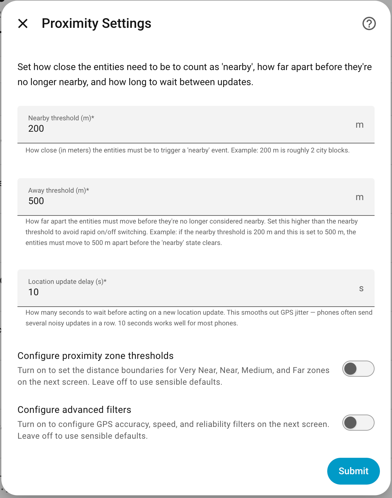
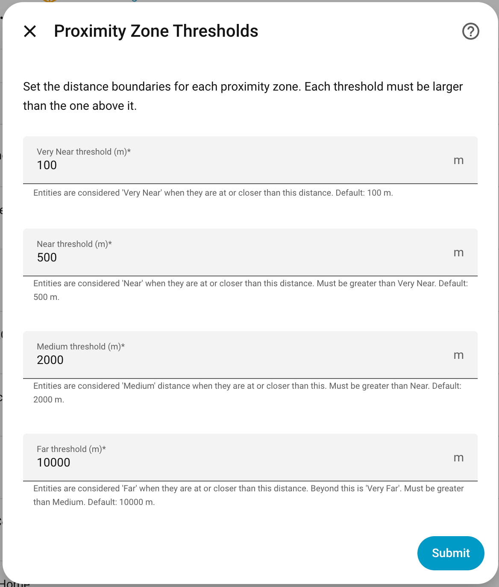
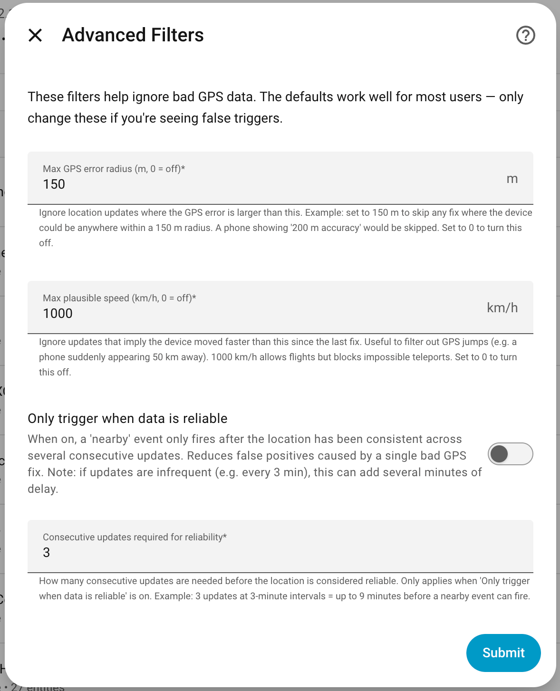

# Entity Distance for Home Assistant

<a href="https://github.com/italo-lombardi/Home-Assistant-EntityDistance/releases"></a>
<a href="https://github.com/hacs/integration"></a>
<a href="https://www.home-assistant.io/"></a>
<a href="https://github.com/italo-lombardi/Home-Assistant-EntityDistance/blob/main/LICENSE"></a>


[](https://my.home-assistant.io/redirect/hacs_repository/?owner=italo-lombardi&repository=Home-Assistant-EntityDistance&category=integration)
[](https://my.home-assistant.io/redirect/config_flow_start/?domain=entity_distance)

Track the distance between any two or more entities — people, devices, or zones — with sensors for direction, closing speed, ETA, and proximity detection. Track a whole family with a single setup.

---

## Features

- **Person-to-person, person-to-zone, device-to-zone, zone-to-zone** — any combination of `person`, `device_tracker`, `sensor`, or `zone` entities
- **Group tracking** — select 2–5 entities; all pairwise distances are tracked under one config entry (2 entities = 1 pair, 3 = 3 pairs, 4 = 6 pairs)
- **Group sensors** — for 3+ entities: Min Distance, Any In Proximity, All In Proximity
- **26 sensors per pair** — distance, proximity zone, proximity zone level, proximity duration, proximity rate, proximity tracking started, last seen together, today proximity time, direction, direction level, closing speed, ETA, today zone times, GPS accuracy, last update, update count, entity state, today unaccounted time (per entity where applicable)
- **Proximity binary sensor** — ON/OFF with configurable entry/exit hysteresis to prevent flickering
- **Same Zone binary sensor** — ON when both entities share the same named zone; unavailable when either is `not_home`
- **Direction of travel** — approaching, diverging, or stationary
- **ETA** — estimated minutes until together, only when approaching
- **Closing speed** — convergence rate in km/h
- **Today proximity time** — total minutes together today, resets at midnight
- **Today zone times** — minutes spent in each proximity zone today (Very Near, Near, Medium, Far, Very Far)
- **Direction Level sensor** — numeric direction: -1 approaching, 0 stationary, 1 diverging
- **GPS accuracy filter** — reject updates with poor GPS fix quality
- **Speed filter** — reject physically implausible location jumps (e.g. GPS teleports)
- **Reliability tracking** — require consistent updates before proximity events fire
- **4 HA events** — fire automations without polling
- **Diagnostic sensors** — GPS accuracy, last update, update count (last 30 min) per tracked entity
- **Refresh button** — force immediate mobile app location update
- **Multiple pairs** — each pair gets its own HA device; add as many as needed
- **Vincenty distance** — uses HA's built-in ellipsoidal distance calculation, more accurate than Haversine
- **Live sensor updates** — all sensors refresh every minute even when entities don't move; duration and gap sensors stay accurate
- **State persistence** — today proximity time, zone times, and proximity duration survive HA restarts

---

## Installation

### HACS (Recommended)

1. Click the badge above or open **HACS → Integrations → Custom repositories**
2. Add `https://github.com/italo-lombardi/Home-Assistant-EntityDistance` with category **Integration**
3. Install **Entity Distance**
4. Restart Home Assistant

### Manual

1. Copy `custom_components/entity_distance/` into your HA `config/custom_components/` directory
2. Restart Home Assistant

---

## Configuration

Go to **Settings → Devices & Services → Add Integration → Entity Distance**.

### Step 1: Select Entities

Select 2–5 entities to track. Supported types: `person`, `device_tracker`, `sensor`, `zone`.

| Field | Description |
|-------|-------------|
| Entities | Select 2 to 5 entities — all pairwise distances are tracked automatically |

For a 2-entity selection you get 1 pair. For 3 entities you get 3 pairs. For 4 entities you get 6 pairs. Each pair gets its own sub-device under the group.

<!-- SCREENSHOT NEEDED: config_flow_step1_entity_select.png
     What to capture:
     - Settings → Devices & Services → Add Integration → Entity Distance
     - Step 1 of the config flow showing the multi-select entity picker
     - Select 3–4 entities (e.g. person.italo, person.dercy, zone.home, device_tracker.xceed)
     - Show the entity list expanded so it is clear multiple selections are possible
     - Recommended: 1200×800 px, light theme
-->


### Step 2: Proximity Settings

| Field | Default | Description |
|-------|---------|-------------|
| Nearby threshold (m) | 200 | Entities must be closer than this to trigger a proximity event |
| Away threshold (m) | 500 | Entities must move further than this before proximity ends (hysteresis) |
| Location update delay (s) | 10 | Seconds to wait before processing a location update — smooths GPS jitter |
| Configure proximity zone thresholds | Off | Turn on to customize Very Near / Near / Mid / Far zone distances |
| Configure advanced filters | Off | Turn on to configure GPS accuracy, speed, and reliability filters |

<!-- SCREENSHOT NEEDED: config_flow_step2_proximity_settings.png
     What to capture:
     - Step 2 of the config flow: proximity/threshold settings form
     - Show all fields: Nearby threshold, Away threshold, Location update delay,
       "Configure proximity zone thresholds" toggle, "Configure advanced filters" toggle
     - Leave all values at their defaults
     - Recommended: 1200×800 px, light theme
-->



### Step 3: Zone Thresholds (optional)

Only shown when "Configure proximity zone thresholds" is enabled in Step 2.

| Field | Default | Description |
|-------|---------|-------------|
| Very Near threshold (m) | 100 | Distance at or below which entities are Very Near |
| Near threshold (m) | 500 | Distance at or below which entities are Near |
| Mid threshold (m) | 2000 | Distance at or below which entities are Mid |
| Far threshold (m) | 10000 | Distance at or below which entities are Far (beyond this is Very Far) |

Thresholds must be strictly increasing: Very Near < Near < Mid < Far.

<!-- SCREENSHOT NEEDED: config_flow_step3_zone_thresholds.png
     What to capture:
     - Step 3 of the config flow: zone threshold settings form
     - Shown only when "Configure proximity zone thresholds" was enabled in step 2
     - Show all 4 fields: Very Near, Near, Mid, Far thresholds with default values
     - Recommended: 1200×800 px, light theme
-->



### Step 4: Advanced Filters (optional)

Only shown when "Configure advanced filters" is enabled in Step 2.

| Field | Default | Description |
|-------|---------|-------------|
| Max GPS error radius (m) | 150 | Ignore updates where GPS error exceeds this radius (0 = off) |
| Max speed filter (km/h) | 1000 | Ignore updates implying movement faster than this — catches GPS teleports, allows flights (0 = off) |
| Only trigger when data is reliable | Off | Require several consistent updates before firing proximity events |
| Consecutive updates required for reliability | 3 | Consecutive updates required before data is considered reliable |

<!-- SCREENSHOT NEEDED: config_flow_step4_advanced_filters.png
     What to capture:
     - Step 4 of the config flow: advanced filter settings form
     - Shown only when "Configure advanced filters" was enabled in step 2
     - Show all fields: Max GPS error radius, Max speed filter, Only trigger when reliable,
       Consecutive updates required
     - Leave all values at their defaults
     - Recommended: 1200×800 px, light theme
-->



All settings can be changed after setup via **Configure** on the integration card.

---

## Entities

Each configured group creates one HA device (the group) with per-pair sub-devices. A 2-entity group creates 29 entities (26 sensors + 2 binary sensors + 1 button). A 3-entity group creates 87 pair entities + 3 group sensors.

| Group size | Pairs | Total entities (approx) |
|-----------|-------|------------------------|
| 2 | 1 | 29 |
| 3 | 3 | 87 + 3 group |
| 4 | 6 | 174 + 3 group |
| 5 | 10 | 290 + 3 group |

### Pair Sensors

| Entity | Description | Device Class |
|--------|-------------|--------------|
| Distance | Distance between entities in meters | `distance` |
| Proximity Zone | Very Near / Near / Medium / Far / Very Far | `enum` |
| Proximity Zone Number | Numeric zone level: 1 (Very Near) to 5 (Very Far) | — |
| Proximity Duration | Minutes currently in proximity (live, includes current session) | `duration` |
| Proximity Tracking Started | Timestamp when tracking began for this pair (set once) | `timestamp` |
| Proximity Rate | Percentage of tracked time spent in proximity | `%` |
| Last Seen Together | Timestamp when the last proximity session ended (exit) — shows "Together now" in the Pair Card while currently in proximity | `timestamp` |
| Today Proximity Time | Total minutes together today — resets at midnight | `duration` |
| Today Very Near Time | Minutes spent Very Near today | `duration` |
| Today Near Time | Minutes spent Near today | `duration` |
| Today Medium Time | Minutes spent at Medium distance today | `duration` |
| Today Far Time | Minutes spent Far today | `duration` |
| Today Very Far Time | Minutes spent Very Far today | `duration` |
| Direction | Approaching / Diverging / Stationary | `enum` |
| Direction Level | Numeric direction: -1 approaching, 0 stationary, 1 diverging | — |
| Closing Speed | Convergence or separation rate in km/h — shown as "Approach speed" when approaching, "Diverging speed" when separating | `speed` |
| Estimated Arrival Time | Minutes until together (only when approaching) | `duration` |
| GPS Accuracy (Name A) | GPS fix accuracy of entity A in meters | `distance` |
| GPS Accuracy (Name B) | GPS fix accuracy of entity B in meters | `distance` |
| Last Update (Name A) | Timestamp of last location change for entity A | `timestamp` |
| Last Update (Name B) | Timestamp of last location change for entity B | `timestamp` |
| Update Count (Name A) | Location updates in the last 30 minutes for entity A | — |
| Update Count (Name B) | Location updates in the last 30 minutes for entity B | — |
| State (Name A) | Current state of entity A (e.g. home, away, zone name) | — |
| State (Name B) | Current state of entity B (e.g. home, away, zone name) | — |
| Today Unaccounted Time | Today's elapsed minutes minus sum of bucket times — captures HA-down windows, invalid GPS, and pre-setup time on install day | `duration` |

> GPS Accuracy, Last Update, and Update Count are diagnostic sensors — collapsed by default in the HA UI.

### Binary Sensors (per pair)

| Entity | Description | Device Class |
|--------|-------------|--------------|
| In Proximity | ON when within nearby distance, OFF when beyond away distance | `presence` |
| Same Zone | ON when both entities are in the same named zone (e.g. both `home`); unavailable when either is `not_home` / `unknown` / `unavailable` | — |

> `Same Zone` is not created for zone-zone pairs (always trivially true).

### Group Sensors (3+ entities only)

| Entity | Description | Device Class |
|--------|-------------|--------------|
| Min Distance | Smallest distance across all pairs in the group | `distance` |
| Any In Proximity | ON when any pair is in proximity | `presence` |
| All In Proximity | ON when every pair is in proximity | `presence` |

### Button

| Entity | Description |
|--------|-------------|
| Refresh Location | Sends a silent push notification to request an immediate location update from both entities (iOS and Android) |

<!-- SCREENSHOT NEEDED: device_card_entities.png
     What to capture:
     - Settings → Devices & Services → Entity Distance → click a pair sub-device
       (e.g. "Italo & Home" or "Dercy & Italo")
     - Show the full device card with all entities listed
     - Scroll to show all 29 entities (sensors, binary sensors, button)
     - Alternatively: two side-by-side screenshots showing top and bottom halves
     - Recommended: 1200×1600 px (tall), light theme
     - Tip: use browser DevTools to reduce zoom so more fits in one shot
-->


---

## Proximity Zone Thresholds

Default thresholds (configurable via **Configure** → **Configure proximity zone thresholds**):

| Zone | Default Distance | Level |
|------|-----------------|-------|
| Very Near | ≤ 100 m | 1 |
| Near | ≤ 500 m | 2 |
| Medium | ≤ 2 km | 3 |
| Far | ≤ 10 km | 4 |
| Very Far | > 10 km | 5 |

The **Proximity Zone Level** sensor exposes the same information as a number (1–5), useful for automations that compare or threshold on zone level without working with strings.

---

## Sensor Calculations

How each computed sensor value is derived:

### Distance

Uses Home Assistant's built-in Vincenty formula (ellipsoidal earth model) on the `latitude` and `longitude` attributes of both entities. More accurate than Haversine for long distances.

### Direction

Requires at least two location updates. Compares current distance to previous distance:

- `|Δdistance| < 50 m` → **Stationary**
- `Δdistance < 0` → **Approaching**
- `Δdistance > 0` → **Diverging**

The 50 m stationary threshold is fixed and not configurable.

### Approach Speed

```
closing_speed_km/h = |Δdistance_m / Δtime_s| × 3.6
```

Available on any update where two prior positions exist. Nonzero even when diverging — represents the rate of separation.

### Estimated Arrival Time (ETA)

```
eta_minutes = current_distance_m / closing_speed_m/s / 60
```

**Only populated when direction is Approaching and closing speed > 0.** `None` on the first update, when stationary, or when diverging. Assumes constant speed — no traffic or route awareness.

### Proximity Duration

Accumulated seconds while `In Proximity` is ON. Each update adds `now − prev_calc_time` to the running total. The current open session is included live (not only closed sessions).

### Today Proximity Time / Today Zone Times

On each update, `elapsed = now − prev_calc_time` is added to the matching bucket. All today counters reset to zero at midnight local time.

### Update Count (Last 30 min)

Rolling window counter. Increments by 1 on each location update for that entity. Resets to 1 when the window (1800 s) has elapsed since it last reset.

### In Proximity (Binary Sensor)

Hysteresis logic prevents flickering:

- **ON** when `distance ≤ entry threshold` (default 200 m)
- **OFF** when `distance > exit threshold` (default 500 m)
- State unchanged while distance is between the two thresholds
- Entry and exit thresholds must differ — equal values are rejected at setup time

### State (Entity A / B)

Direct mirror of `hass.states[entity_id].state`. Returns whatever HA reports — `home`, `not_home`, a zone name, `unavailable`, etc. No computation; read-only.

### Today Unaccounted Time

```
unaccounted_minutes = (now − today_midnight) − sum(today_zone_seconds) / 60
```

Measures how many minutes of today are not credited to any zone bucket. Typically caused by HA being down, the pair being invalidated (GPS unavailable, accuracy filter, resync hold), or — on day 1 — by setup happening after midnight (tracking starts mid-day, so the pre-setup hours are legitimately unaccounted by definition). The `tracking_started` attribute exposes when the pair was first set up so a large initial value has obvious context. Clamps to `0` if accounted time exceeds elapsed (cannot go negative).

### Live Updates

All sensors refresh on a 1-minute timer tick even when entities don't move. This keeps duration and gap sensors accurate between GPS updates. Entity state changes also trigger an immediate recalculate (debounced by the configured delay).

---

## Events

Four events are fired on the HA event bus:

| Event | Fired when |
|-------|------------|
| `entity_distance_enter` | Entities enter proximity (reliable data) |
| `entity_distance_enter_unreliable` | Entities enter proximity (unreliable data) |
| `entity_distance_leave` | Entities leave proximity |
| `entity_distance_update` | Location updated while proximity state unchanged |

### Event payload

```yaml
entity_a: person.alice
entity_b: person.bob
distance_m: 320.5
entry_threshold_m: 200
exit_threshold_m: 500
reliable: true
direction: approaching
closing_speed_kmh: 12.3
```

---

## Automation Ideas

### Notify when entities are nearby

```yaml
automation:
  - alias: "Notify when nearby"
    trigger:
      - platform: state
        entity_id: binary_sensor.entity_distance_alice_bob_proximity
        to: "on"
    action:
      - service: notify.mobile_app
        data:
          title: "Alice and Bob are nearby"
          message: >
            {{ states('sensor.entity_distance_alice_bob_distance') }} m apart
```

### Notify when approaching

```yaml
automation:
  - alias: "Notify on approach"
    trigger:
      - platform: state
        entity_id: sensor.entity_distance_alice_bob_direction
        to: "approaching"
    action:
      - service: notify.mobile_app
        data:
          title: "Someone is approaching"
          message: >
            ETA: {{ states('sensor.entity_distance_alice_bob_eta') }} min
```

### Use in an automation with event trigger

```yaml
automation:
  - alias: "React to proximity enter"
    trigger:
      - platform: event
        event_type: entity_distance_enter
        event_data:
          entity_a: person.alice
          entity_b: person.bob
    action:
      - service: notify.mobile_app
        data:
          title: "Together"
          message: >
            Distance: {{ trigger.event.data.distance_m | round(0) }} m
```

---

## Lovelace Cards

The integration ships two custom Lovelace cards, automatically registered as resources when the integration loads.

### Entity Distance — Pair Card (`entity-distance-pair-card`)

A data-focused card showing distance, direction, proximity status, and stats.

```yaml
type: custom:entity-distance-pair-card
slug: italo_home        # auto-detected from dropdown in the visual editor
```

**All options:**
```yaml
type: custom:entity-distance-pair-card
slug: italo_home
title: ""                     # optional custom title
show_distance: true
show_direction: true
show_zone: true               # proximity zone label
show_proximity_badge: true    # In Proximity / Not in Proximity badge
show_speed: true              # approach speed
show_eta: true                # ETA (only when approaching)
show_proximity_duration: false
show_today_time: true         # time together today
show_last_seen: false
show_today_zone_times: false  # time per zone (Very Near, Near, …)
show_entity_states: true      # current state of each person (Home / Away / zone)
show_proximity_rate: false    # % of tracked time spent together
show_unaccounted_time: false  # minutes today with no GPS data
show_gps_accuracy: false
show_last_update: false
show_update_count: false      # update count last 30 min
compact: false
```

### Entity Distance — Avatar Card (`entity-distance-avatar-card`)

A people-focused card with entity avatars side-by-side.

```yaml
type: custom:entity-distance-avatar-card
slug: italo_home
entity_a: person.italo        # optional: for avatar lookup
entity_b: person.dercy        # optional: for avatar lookup
```

**All options:**
```yaml
type: custom:entity-distance-avatar-card
slug: italo_home
entity_a: person.italo
entity_b: person.dercy
title: ""
show_direction: true
show_zone: true
show_proximity_badge: true
show_speed: true
show_eta: true
show_today_time: true
show_proximity_duration: false
show_last_seen: false
show_entity_states: true      # current state of each person (Home / Away / zone)
show_proximity_rate: false    # % of tracked time spent together
show_unaccounted_time: false  # minutes today with no GPS data
compact: false
```

The visual editor (pencil icon in Lovelace) shows a dropdown of all configured pairs and checkboxes for each option — no YAML editing required.

### Entity Distance — Group Card (`entity-distance-group-card`)

A force-directed SVG graph showing all entities in a group as circles connected by labeled lines. Lines are colored by proximity zone and glow when entities are in proximity. Each line shows the distance, a direction arrow (↑ diverging, ↓ approaching, • stationary), and the zone name. Tap a line to open the HA more-info panel for that pair's distance sensor.

```yaml
type: custom:entity-distance-group-card
entities:
  - person.italo
  - person.dercy
  - zone.home
  - device_tracker.kia_xceed
title: ""           # optional, defaults to entity names joined with ·
fixed_layout: false # equal spacing regardless of real distance
hidden_entities: [] # entity IDs to hide from graph
pair_settings:
  "person.dercy,person.italo":  # sorted alphabetically
    show_distance: true
    show_zone: true
node_settings:
  person.italo:
    show_name: true
    show_state: true
    label_position: above  # above | below | auto (default: auto)
  person.dercy:
    label_position: below
```

**Options:**

| Option | Default | Description |
|--------|---------|-------------|
| `entities` | required | List of 2–5 entity IDs to show in the graph |
| `title` | `""` | Card title; defaults to entity friendly names joined with `·` |
| `fixed_layout` | `true` | Equal edge lengths regardless of real distance |
| `hidden_entities` | `[]` | Entity IDs to hide — their nodes and all connecting lines are removed; hidden pairs are excluded from the badge count |
| `pair_settings` | `{}` | Per-pair overrides, keyed by sorted entity ID pair (`"entity_a,entity_b"`). Each entry supports `show_distance` (bool) and `show_zone` (bool) |
| `node_settings` | `{}` | Per-node label overrides, keyed by entity ID. Each entry supports `show_name` (bool), `show_state` (bool), and `label_position` (`above` \| `below` \| `auto`) |

**Layout behaviour:**

Nodes are placed in a grid based on entity count: 2 = vertical pair, 3 = triangle, 4 = 2×2 grid, 5 = 3-row with center middle node. Node labels default to `auto` position (centroid-based detection); use `label_position: above` or `below` in `node_settings` for stable explicit placement. When `fixed_layout: true` (default), no idle animation plays — nodes stay on their grid positions.

The visual editor auto-discovers available groups from hass.states and presents them in a dropdown — no manual entity ID entry required. Use the editor's entity list to reorder nodes, toggle per-entity visibility (eye icon), set the title, enable equal spacing, configure per-node label settings, and configure per-pair distance and zone label visibility.

<!-- SCREENSHOT NEEDED: lovelace_entity_distance_group_card.png
     What to capture:
     - A Lovelace dashboard showing the entity-distance-group-card
     - Use a 4-entity group (person + person + zone + device_tracker) so 6 lines are shown
     - Ideal state: at least one pair in proximity (green glowing line) and others not
     - Show the full card including the header badge ("X of 6 pairs in proximity")
     - Recommended: 800×500 px, light or dark theme
-->


If auto-registration fails (e.g. YAML-only Lovelace mode), add manually:

```yaml
resources:
  - url: /entity_distance/entity-distance-pair-card.js?0.2.8
    type: module
  - url: /entity_distance/entity-distance-avatar-card.js?0.2.8
    type: module
  - url: /entity_distance/entity-distance-group-card.js?0.2.8
    type: module
```

<!-- SCREENSHOT NEEDED: lovelace_entity_distance_card.png
     What to capture:
     - A Lovelace dashboard showing the entity-distance-pair-card
     - Ideal state: entities NOT in proximity, with a real distance value (e.g. 3.5 km)
       so the card shows distance, direction, zone, speed fields populated
     - Show at least one card, ideally two side-by-side (one person-to-person, one person-to-zone)
     - Recommended: 800×500 px, light or dark theme (pick the one that looks better)
-->


<!-- SCREENSHOT NEEDED: lovelace_entity_distance_people_card.png
     What to capture:
     - A Lovelace dashboard showing the entity-distance-avatar-card
     - Ideal state: two people with avatars visible, NOT in proximity (so the badge shows "Not in Proximity")
     - The card should show entity avatars side-by-side with distance and zone info between them
     - Recommended: 800×400 px, light or dark theme (pick the one that looks better)
-->


---

## Zone Support

Zones (`zone.*`) are supported as either entity in a pair:

- Zones use `latitude`/`longitude` attributes — GPS accuracy and speed filters are not applied to zones
- Person-to-zone: direction and ETA work normally
- Zone-to-zone: distance is static; direction always stationary

> Movement of less than 50 m between updates is classified as stationary.

---

## Contributing

Contributions welcome!

1. Fork the repository
2. Create a feature branch: `git checkout -b feature/my-feature`
3. Commit with clear messages
4. Open a Pull Request against `main`

### Development Setup

```bash
git clone https://github.com/italo-lombardi/Home-Assistant-EntityDistance.git
python -m venv venv
source venv/bin/activate
pip install -r requirements_test.txt
```

### Running Tests

```bash
python -m pytest tests/ -v
```

### Guidelines

- Follow [Home Assistant integration development guidelines](https://developers.home-assistant.io/)
- Add translations for any new user-facing strings
- Write tests for new functionality
- Keep PRs focused — one feature or fix per PR

---

## Inspiration

Inspired by [HA-Member-Adjacency](https://github.com/1bobby-git/HA-Member-Adjacency). Entity Distance is a full rewrite with direction/speed/ETA sensors, diagnostic entities, full test coverage, CI/CD, and HACS submission.

---

## Sibling integrations

- [Entity Availability](https://github.com/italo-lombardi/Home-Assistant-EntityAvailability) — track offline entities, availability history, and degraded states with a custom dashboard card.
- [Entity Guard](https://github.com/italo-lombardi/Home-Assistant-EntityGuard) — guard entities against unintended state changes; alert and revert when configured rules are violated.
- [Fuel Compare](https://github.com/italo-lombardi/Home-Assistant-FuelCompare) — live fuel prices and station data for Irish petrol stations from fuelcompare.ie.

---

## License

This project is licensed under the GNU General Public License v3.0. See the [LICENSE](LICENSE) file for details.

> This is an unofficial integration not affiliated with Home Assistant.
